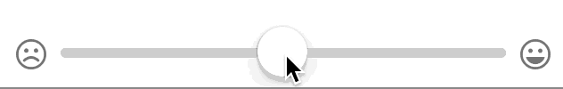

HUMSlider
=========

A slider control with auto-appearing ticks and saturating images at each end. Straight from the codebase of [Hum.](http://justhum.com)



##Setup

To use this control, we strongly recommend using [CocoaPods](http://cocoapods.org). To do so add the following to your `Podfile`:  

```
pod 'HUMSlider', ~>'1.0'
```

and then `pod install`. 

##Usage

A quick programmatic example of the most common use case: 

```objectivec
    HUMSlider *slider = [[HUMSlider alloc] init];

	// Set the images to be saturated and desaturated
	slider.minimumValueImage = [UIImage imageNamed:@"minImage"];
    slider.maximumValueImage = [UIImage imageNamed:@"maxImage"];
    
    // What color should the image be when the thumb is close to it?
    slider.saturatedColor = [UIColor greenColor];
    
    // What color should the image be when the thumb is not close to it?
    slider.desaturatedColor = [[UIColor redColor] colorWithAlpha:0.5f]; 
    
    // How many ticks do you want?
    slider.sectionCount = 11; // This should be an odd number.
    
    // What color should the ticks be?
    slider.tickColor = [UIColor blackColor];    
```

Full code is available in the sample app included in this repo. 

##Usage notes

- The number of ticks **must be odd** - otherwise pretty much all the math for centering things breaks spectacularly. Attempting to add an even number of ticks will cause an assertion failure during development.
- If you are using a custom thumb image which has some clear space at the top, use the `pointAdjustmentForCustomThumb` property to compensate for this. 
- This control defines its own intrinsic content height based on how high the ticks will pop up, but does not define its own intrinsic content width. 
- Images passed in as min/max images will automatically be set to use `UIImageRenderingModeAlwaysTemplate` in order to facilitate the saturation and desaturation of the image using tint colors.
- Images will perform best when they're un-styled. Let the code set the colors. 
- If no min/max images are passed in, the slider track will take up the full length of the control. 
- If you set the `saturatedColor` or `desaturatedColor` properties, it will set the same color on both sides. Use the `setSaturatedColor:forSide:` and `setDesaturatedColor:forSide` to set separate colors per side. 


#Contributors

- Design: [Aaron Shekey](http://github.com/aaronshekey)
- Engineering: [Ellen Shapiro](http://github.com/designatednerd)